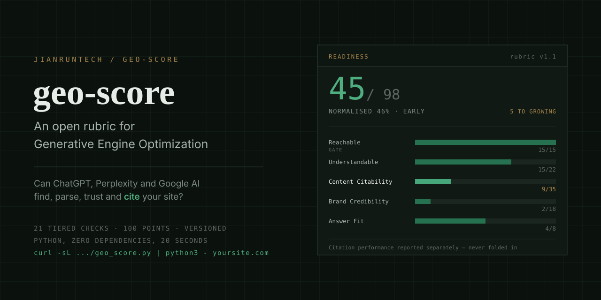

<p align="right"><a href="README.md">English</a> · <a href="README.zh-CN.md">简体中文</a></p>

<p align="center"></p>

# geo-score

**ChatGPT 会不会引用你的网站？20 秒跑出分数。**

[](LICENSE)
[](rubric/v1.1.zh-CN.md)
[](cli/geo_score.py)
[](SKILL.md)
[](CONTRIBUTING.md)
[](https://jianruntech.github.io/geo-score/zh.html)

```bash
curl -sL https://raw.githubusercontent.com/jianruntech/geo-score/main/cli/geo_score.py \
  | python3 - stripe.com --brief
```

<p align="center"></p>

<sub>一行命令，约二十秒。每一项的分数，以及上一档要什么。</sub>


<details>
<summary>完整输出（每一项的分数、证据与下一档要求）</summary>

```
  AIV READINESS  https://stripe.com
──────────────────────────────────────────────────────────────────────────
  71 / 100   Solid
  12 points to Leading

  Reachable 11/15
   ◐ Crawlers allowed in robots.txt   ███████████░░░░░░░  3/5
   ✓ Reachable to retrieval agents    ██████████████████  5/5
   ◐ Main content server-rendered     ███████████░░░░░░░  3/5
  Understandable 15/22
   ◐ Sitemap discoverable and fresh   █████████░░░░░░░░░  2/4
   ✓ llms.txt present and structured  ██████████████████  5/5
   ✓ Organization + WebSite schema    ██████████████████  6/6
   ✗ BreadcrumbList on nested pages   ░░░░░░░░░░░░░░░░░░  0/3
   ◐ Page-type schema (Product, FAQ…) █████████░░░░░░░░░  2/4
  Content Citability 25/35
   ✓ Self-contained answer passages   ██████████████████  9/9
   ◐ Headings match how people ask    ████████░░░░░░░░░░  3/7
   ◐ Freshness signal present         █████████░░░░░░░░░  3/6
   ✓ Statistics carry a source        ██████████████████  7/7
   ◐ Named, verifiable authorship     █████████░░░░░░░░░  3/6
  Brand Credibility 8/10
   ⊘ Third-party listings             ··················   —
   ⊘ Independent mentions             ··················   —
   ✓ Knowledge-graph entity           ██████████████████  4/4
   ◐ sameAs links resolve             ████████████░░░░░░  2/3
   ◐ Video and multimodal presence    ████████████░░░░░░  2/3
  Answer Fit 2/4
   ◐ Content shaped for extraction    █████████░░░░░░░░░  2/4
   ⊘ Covers the questions people ask  ··················   —
   ⊘ Chinese engine readiness         ··················   —
  Biggest gaps
   +4   Headings match how people ask    about half do
   +3   Named, verifiable authorship     and the name links to a verifiable identity page
   +3   Freshness signal present         most pages do, and dateModified agrees with the visible date

  Scored 61 / 86 observable · 4 checks left the denominator · rubric v1.1
  Needs judgement: p3.listings, p3.mentions, p4.question-coverage, p4.cn-engines

  Full rubric and what each tier means:
  https://github.com/jianruntech/geo-score
```

</details>

Python 3.8+，只用标准库，不用装任何东西。它读取公开 URL，
按一套**公开、带版本号的评分口径**给分——不是黑箱。

**[看 164 个知名站点的公开榜单 →](https://jianruntech.github.io/geo-score/zh.html)**  ·  其中四分之一根本无法被引用。

> **GEO 指的是生成式引擎优化**——让 ChatGPT、Perplexity、Google AI Overviews、
> Gemini、Copilot 引用你。与地理、地图无关。

---

## 这和 SEO 问的不是同一个问题

传统 SEO 问「我排第几」。回答引擎不排名——它检索段落、判断这个来源值不值得引用、
然后引用它。问题不同，失效方式也不同：一个站可以在 Google 排第 3 却从不被引用，
而一个没人链接的页面天天被引，因为它的段落干净。

决定这件事的东西，**大部分是机械的、改起来很便宜**——一行 `robots.txt`、
一个 JSON-LD 块、模板里的一个日期、把一段话改写成能独立成立的样子。
难的是知道自己缺了哪几项，以及每一项值多少分。

## 查什么

21 项阶梯式检查合计 100 分，另有 4 项加分检查、不进分母、最多 +6。
完整规范：**[rubric/v1.1.zh-CN.md](rubric/v1.1.zh-CN.md)** · [English](rubric/v1.1.md)

| 支柱 | 分值 | 在问什么 |
|---|:-:|---|
| **可被抓取** —— *门槛* | 15 | 检索爬虫拿不拿得到这一页？`robots.txt`、10 个 AI UA 的实测可达性、正文是否服务端渲染 |
| **可被理解** | 22 | 它能不能看懂这是什么页、你是哪家公司？`Organization` + `WebSite`、`llms.txt`、sitemap、面包屑、页型 schema |
| **内容可被引用** | **35** | 这里有没有值得引用的东西？自足答案段、标题是否匹配人的提问措辞、数据带出处、真实署名、时间信号 |
| **品牌可信** | 18 | 引擎凭什么信你？知识图谱实体、第三方收录、可解析的 `sameAs`、视频存在 |
| **问答适配** | 10 | 内容的形态便不便于被摘进一个答案？ |

内容可被引用权重最高是有意的：回答引擎检索的是**段落**，不是域名。
段落的结构比域名的权威更常起决定作用——这一点和传统 SEO 的直觉相反。

**每个计分项都是阶梯给分**——2 到 4 档，每一档写的是 8 个抽样页里的具体页数，
所以两个人给同一个站打分，在算术上不会有分歧。**其中三项是门槛**：
爬虫可达性、实测可达、服务端渲染，任一项得 0 分则总分封顶 40——
因为在爬虫拿不到内容之前，其余各项的改动都不会产生效果。

### 分数段

| 0–30 | 31–50 | 51–65 | 66–82 | 83–100 |
|:-:|:-:|:-:|:-:|:-:|
| 未起步 | 起步期 | 成长期 | 基础扎实 | 领先 |

档名描述的是**所处阶段，不是判决**。外部基准显示多数商业网站落在 30–55 之间，
所以四十几分是常态，不是警报。

## 164 个站点，公开打分

**其中四分之一根本无法被引用。** 41 个站有门槛项得 0 分——检索爬虫压根拿不到内容。
其中 14 个在 `robots.txt` 里点名屏蔽 AI 爬虫，那是编辑决策，如实记录即可——
amazon.com 只有 8 分正是这个原因。**另有 21 个站的正文只在 JavaScript 跑完之后才存在**，
里面有六家 AI 公司。内容是有的，浏览器看得见，爬虫拿到的是一个空壳。
这一组几乎肯定不是有意的。

中位数 **59.0**，区间 7 到 95。

| 站点 | 分数 | 档 |
|---|:-:|---|
| minimaxi.com | **95** | 领先 |
| pulumi.com | **95** | 领先 |
| resend.com | **94** | 领先 |
| zapier.com | **92** | 领先 |
| netlify.com | **91** | 领先 |
| … | | |
| lianlianpay.com | 14 | 未起步 |
| amazon.com | 8 | 未起步 |
| mercadolibre.com | 7 | 未起步 |

**[完整榜单与分行业中位数 →](https://jianruntech.github.io/geo-score/zh.html)** · [markdown](benchmark/README.md) · [原始数据](benchmark/results.json) · [自己重跑](benchmark/run.py)

另外两个值得点进去看的发现：面向中文市场的站比其余站**低 20 分**（中位 43.0 对 62.5——
这个差距在三次独立取样里稳定在 20–23 分）；以及同样三件很便宜的事——
模板里的一个日期、一段能独立成立的开头、一个 JSON-LD 块——在超过一半的站上都缺。

每个数字都能用页首那条命令复现。对其中五个参照站，
我们另外发布了**人工逐项审计**，覆盖全部 21 项检查、每一项都附证据：
[examples/audits/v1.1/](examples/audits/v1.1/)。

## 三种跑法

**CLI** —— 不用装、无依赖、20 秒。

```bash
python3 cli/geo_score.py example.com            # 人读
python3 cli/geo_score.py example.com --explain  # 带每一项背后的证据
python3 cli/geo_score.py example.com --json     # 符合 schema/report.v2.json
python3 cli/geo_score.py example.com --compare competitor.com   # 和竞品并排比
python3 cli/geo_score.py example.com --badge aiv-badge.svg      # 生成可嵌入的 SVG 徽章
```

**GitHub Action** —— 每次 push 都打分，退步就让构建失败。

```yaml
- uses: jianruntech/geo-score@v1
  with:
    url: https://example.com
    fail-under: 40
```

**Claude Code 技能** —— CLI 只能测静态抓取看得见的东西。
有四项需要站外检索或人的判断，技能把这些也做了。

```bash
git clone https://github.com/jianruntech/geo-score ~/.claude/skills/geo-score
# 然后：/geo-score audit https://example.com
```

CLI 会把那四项**退出分母**而不是猜，所以它给出的分比完整审计略低——
对一个已经有品牌积累的站，通常低 5 到 15 分，因为收录和第三方提及是 CLI 看不见的。

## 为什么发布口径，而不只发工具

一个你没法复核的分数，就是别人编出来的数字。所以规范本身才是产品，工具只是它的实现：

- **带版本号。** 每个分数都要报口径版本。`71（v1.1）`是一个主张，`71` 不是。
- **阶梯给分，写明页数。** 每一档写的是 8 页里的具体页数，不是「多数」。
- **必须有证据。** 每一项都要留一个别人能复现的观察。
- **对着公开基准标定过**，并[公开了标定记录](rubric/calibration-v1.1.zh-CN.md)——包括档位线所对照的四份外部数据，以及真实审计暴露、v1.1 逐条定掉的[八处口径歧义](rubric/open-questions.zh-CN.md)。
- **机器可读。** [`rubric/v1.1.json`](rubric/v1.1.json) 带永久 check id，[`schema/report.v2.json`](schema/report.v2.json) 让不同实现跑出来的结果可以互相比较。

用你自己的技术栈实现它、对某个权重有异议，[开一个口径提案](.github/ISSUE_TEMPLATE/rubric_proposal.yml)。这是我们最希望收到的贡献。

## 边界 · 这个仓库不做什么

这是大多数工具会略过的部分，所以直说。

**geo-score 只测量，不修复。**

| 不包含 | 为什么 |
|---|---|
| 修复模板 —— `robots.txt`、JSON-LD 代码块、`llms.txt` 样板 | 修复才是真正需要工作量和判断的地方，那是另一个不开源的项目 |
| 内容改写 —— 怎么把一段话写成会被引用的样子 | 同上 |
| 分平台打法 —— 对 Perplexity 和对 Gemini 该分别怎么做 | 同上 |
| 改造路线图 | 同上 |

**其他要说清的限制：**

- **它测的是输入侧的就绪度，不是结果。** 分高只说明引擎**能**引用你，
  至于**会不会**引用，取决于竞争和提问意图，这些外部审计观察不到。
  引用表现单独测、单独报，**不进这 100 分**——见
  [两个分数，不要混在一起](rubric/v1.1.zh-CN.md#两个分数不要混在一起)。
- **品牌可信与具名作者这一项需要人的判断。**「这个作者是不是真实可查的人」
  「这条提及是不是独立的」没法完全自动化。这 24 分左右应当视为辅助判定。
- **阶梯降低分歧，但消不掉分歧。** 每一档都写成 8 个抽样页里的具体页数，
  所以两个审计者在算术上不会分歧；但「这一段算不算自足答案」仍然是判断。
  [已定掉的歧义](rubric/open-questions.md)是我们发现的那些，一定还有别的。
- **重客户端渲染的站会打低分，有时不公平。** 如果内容要 hydration 之后才出现，
  大部分检查读到的是 hydration 之前的 HTML——那也大致就是爬虫看到的，
  所以低分通常是对的，但值得人工复核一遍。
- **引擎行为会变。** 口径带版本号正是为此。旧版本口径算出来的分与当前版本不可比。

## 权重的研究依据

权重是有主张的，但不是拍脑袋。影响最大的两项：

- **[Aggarwal et al., *GEO: Generative Engine Optimization*, KDD 2024](https://arxiv.org/abs/2311.09735)**
  —— 引用来源、加入统计数字、引述专家可以把可见度提升**最多 40%**
  （度量口径是 Position-Adjusted Word Count，不是引用次数）。
  值得注意的是，论文发现**「权威语气」没有显著提升**——
  这正是本口径给结构和出处打分、而不给语气打分的原因。
- **[llms.txt 提案，Answer.AI](https://llmstxt.org/)** —— 可被理解支柱里 `p1.llms-txt` 检查的就是它。

凡是依据我们自己的观察而非公开研究的检查项，口径里都会注明。
如果你有证据表明某个权重不对，
[提一个口径提案](.github/ISSUE_TEMPLATE/rubric_proposal.yml)——这是我们最希望收到的贡献。

## 相关项目

刻意说清这个仓库**不是**什么，方便你选对工具：

| 项目 | 做什么 | 关系 |
|---|---|---|
| [llms-txt](https://github.com/AnswerDotAI/llms-txt) | `llms.txt` 规范本体 | geo-score 检查是否符合它 |
| [yao-geo-skills](https://github.com/yaojingang/yao-geo-skills) | 21 个分类 GEO 技能，偏执行 | 互补——它做生产，这里做测量 |
| [GEOFlow](https://github.com/yaojingang/GEOFlow) | 企业官网 GEO 运营系统 | 范围大得多；AGPL 协议 |

如果你要的是修复而不只是一个分数，上面这些项目覆盖了本仓库刻意排除的那部分。

## 谁在维护

由深圳 **[见润科技](https://www.jianruntech.com)** 建立并维护——
我们为跨境出海企业做 GEO 与 AI 落地。这套口径来自客户项目和优化我们自己产品的过程；
把它公开，是希望 AI 可见度能有一个一致的衡量方式，**包括被那些永远不会成为我们客户的人使用**。

本仓库的商业使用不受限制（MIT），包括用在付费咨询项目里。
不需要获得我们许可，也没有另外的商业授权。

## 参与贡献

最有价值的贡献是**关于权重的证据**。见 [CONTRIBUTING.md](CONTRIBUTING.md)。

## 引用

在研究或报告中引用本口径，见 [CITATION.cff](CITATION.cff)。

## 开源协议

[MIT](LICENSE)
